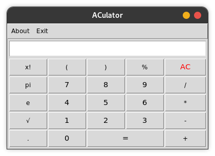
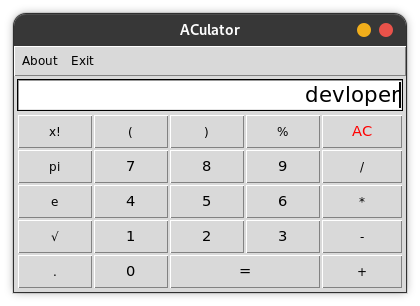
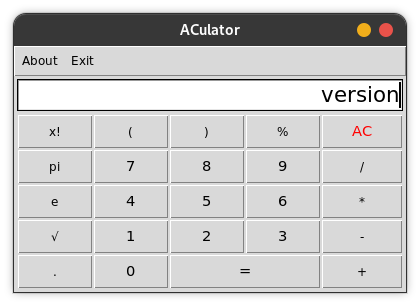
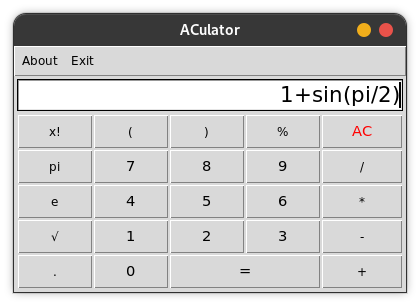
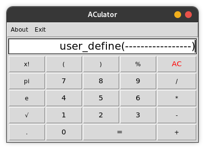
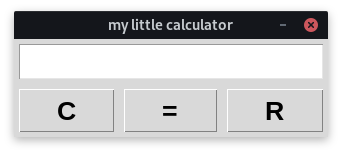
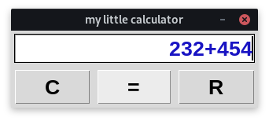
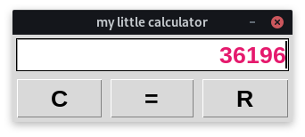

# ACulator

## A Simple Calculator that can do more

## Default built-in variable

key words | value
------------ | -------------
devloper | show the devloper name
version | show the current version of ACulator
## You can also use all function or variable of python's math module

### some useful math variable
* e
* pi
### some useful math function
* ceil(x)
* comb(n,k)
* copysign(x,y)
* factorial(x)
* floor(x)
* fabs(x)
* gcd(*integers)
* lcm(*integers)
* remainder(x, y)
* exp(x)
* sqrt(x)

#### U can check python's documentation [math](https://docs.python.org/3/library/math.html)
## Support of many useful built-in functions

## Also user can add or define their own variables,functions or even objects

# A Little calculator with random color feature 

